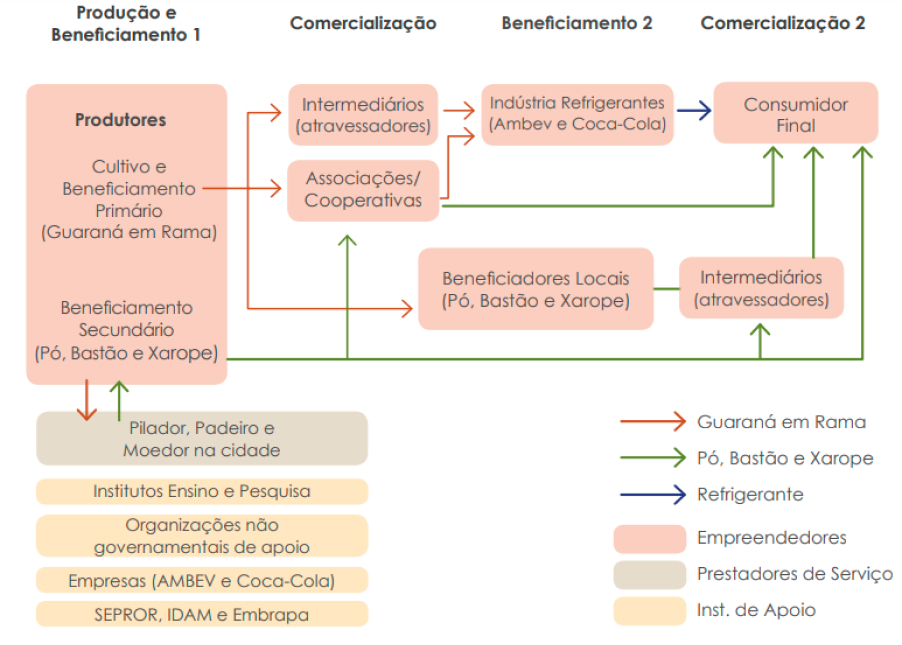
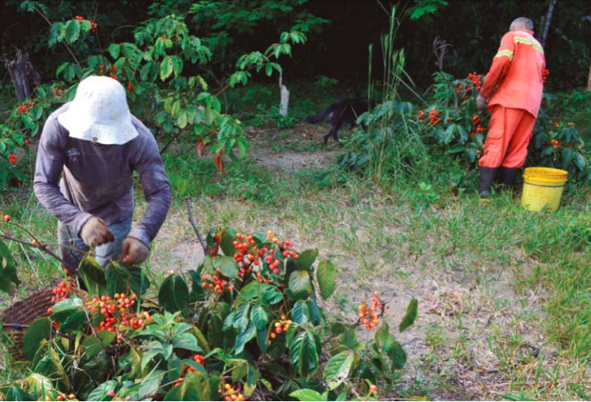
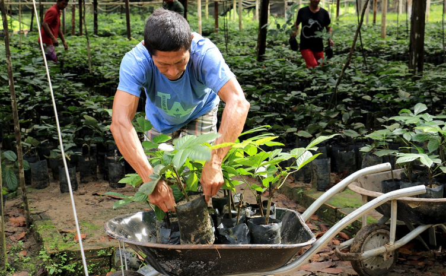
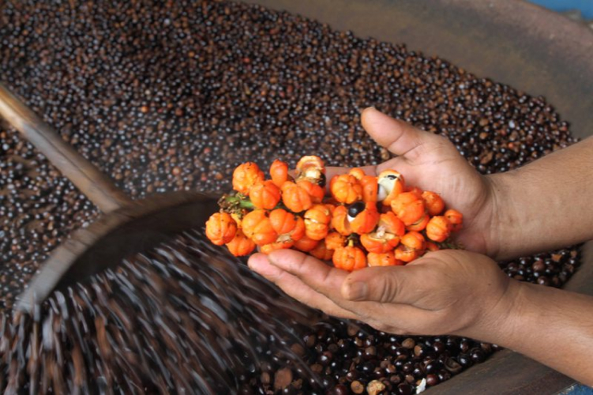
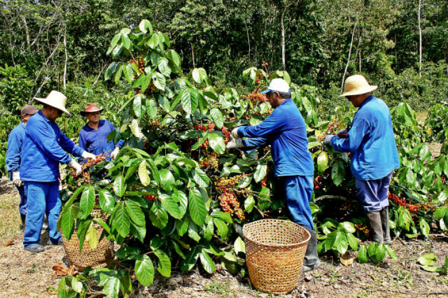
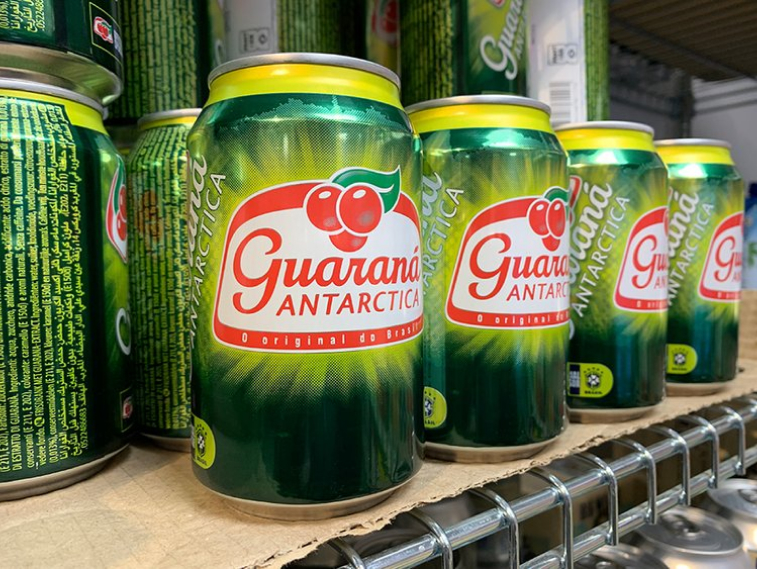
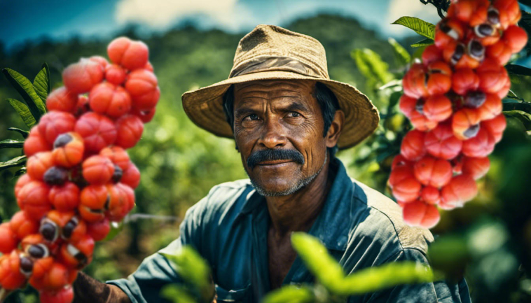
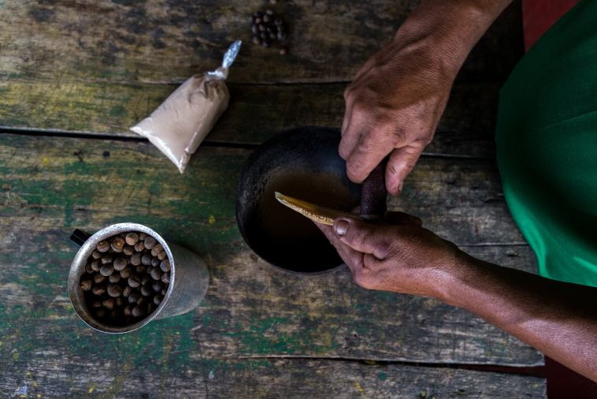

# Cadeia de Valor do Guaraná de Maués

A cadeia de valor do guaraná de maués (Figura abaixo) foi desenhada em quatro etapas principais: produção e beneficiamento primário (guaraná em rama), comercialização do guaraná em rama, beneficiamento secundário (pó, bastão, xarope e extrato) e comercialização dos subprodutos do guaraná. O fluxograma da cadeia foi definido através de entrevistas individuais com produtores rurais, intermediários e beneficiadores e diagnósticos participativos realizados com cinco grupos de produtores de diferentes localidade, incluindo indígenas.

## Etapa 1. Produçaõ e Beneficiamento Primário 
### Produção geral do guaraná em rama (grãos torrados) 
</img>

A produção do guaraná em rama pelos produtores familiares ocorre em três etapas: produção (preparo, plantio e manejo), colheita e beneficiamento primário. Esta última abrange atividades de despolpa, lavagem e torrefação da semente. O trabalho é realizado pela família, através de troca de serviços, grupos de trabalho (puxirum) ou pagamento de diárias.

</img>

### Produção: preparo da área, plantio e manejo
</img>

O cultivo do guaraná no município ocorre a partir de mudas produzidas por semente ou estaquia (clonado).
A primeira etapa da produção abrange as atividades de preparo da área e plantio. O preparo da área – limpeza, derrubada, queima e balizamento (piquetes) para plantio das mudas - ocorre entre os meses de julho a outubro e demanda, em média, cerca de 30 diárias de trabalho (mão de obra). O plantio e replantio das mudas, geralmente é realizado entre os meses de dezembro a fevereiro, quando se inicia a estação das chuvas na região, e demanda, em média, 28-40 diárias de trabalho. Esta primeira fase não ocorre necessariamente todo ano, visto que uma área de cultivo de guaraná produzem mais de 20 anos, segundo produtores entrevistados...

### Colheita
</img>

A colheita dos frutos ocorre principalmente entre os meses de outubro a dezembro, período da safra do guaraná. Esta ocorre manualmente, com ou sem a utilização de tesouras, retirando os frutos maduros identificados conforme a abertura do fruto, e o cacho inteiro é normalmente colhido quando mais de 50% dos frutos estão abertos. A diferença no tempo de amadurecimento entre os frutos é uma das principais dificuldades na colheita, exigindo que o produtor realize a colheita seletiva constante para maior qualidade no produto final. Os frutos são geralmente coletados na área de plantio com os tradicionais paneiros, que são cestos de teçume, trançados de cipó ou palha, e para transportar da área para o local de beneficiamento utilizam geralmente sacos de ráfia.

### Despolpa, lavagem e torrefação da semente
</img>

As propriedades geralmente possuem um galpão (“barracão”) com cobertura para armazenar, fermentar, despolpar e torrar o guaraná após a colheita. Os barracões são equipados com uma “gareira” - utensílio feito com “casco” de canoa ou tronco (gamela) utilizado para fermentação e despolpa - e um forno de torrefação - que pode ser feito de ferro ou barro. Algumas regiões ainda preservam os tradicionais fornos de barro, preparados com argila branca e cinza da casca do caraipé (Licania sp.), árvore comumente encontrada na região, mas a maioria atualmente vem utilizando o tacho de ferro...

## Etapa 2 - Comercialização do Guaraná em Rama
</img>

Há dois destinos para o guaraná em rama: produção de pó, bastão ou xarope e matéria-prima para indústrias de refrigerantes. Este último caminho é o mais expressivo, em termos de volume de produto comercializado, e ocorre via intermediários (atravessadores), associação ou cooperativa de produtores. 
Os intermediários (atravessadores) são atores de destaque em toda a cadeia do guaraná e geralmente possuem um comércio flutuante perto da orla do rio Maués Açú, em frente a cidade, onde ficam os barcos, ou nas principais ruas da cidade. Normalmente o agricultor tem que, pessoalmente ou em grupo, negociar os termos de comercialização, em grande parte direto com os atravessadores ou representantes desses intermediários...

## Etapa 3 - Beneficiamento 2
### Indústrias de Refrigerante - Extratos concentrados
</img>

O processo industrial para fabricação de concentrados, principalmente para bebidas gaseificadas (refrigerante), é realizado por grandes indústrias, que adquirem as sementes torradas, processando essa matéria-prima, transformando em extrato concentrado de guaraná.

### Beneficiadores secundários - Produtores tradicionais
</img>

O beneficiamento tradicional do guaraná para produção do pó e bastão (pão) é realizado pelos agricultores familiares da região de Maués, indígenas e ribeirinhos, com mão de obra familiar e parcerias em alguns processos, podendo ser ao descascar, moer, pilar ou “na panificação”.

### Beneficiadores locais - “Piladores” comerciais
</img>

Este processo de beneficiamento comercial no município é feito pelos conhecidos “piladores” locais de guaraná em rama, para produção de bastão, pó e xarope, havendo também os beneficiadores com o moinho que apenas descascam e moem o guaraná em rama, processo mais simples, terceirizando o serviço para comerciante e para vender o próprio guaraná em pó. Todos são beneficiadores em maior escala que estão na sede do município e utilizam maquinários em praticamente todos os processos de beneficiamento do guaraná.

## Etapa 4. Segundo Elo de Comercialização
### Consumidor final
</img>

O principal ator do último elo da cadeia é o consumidor final, que adquire os subprodutos do guaraná – refrigerante, pó, bastão e xarope – através dos mercados, intermediários, vendedores, beneficiadores, associações, cooperativas ou diretamente pelo produtores..

- **Link do Projeto no Figma:** [https://www.figma.com/file/1bP9CnXCrahgm8gg7lsFBQ/mauestropical?type=design&node-id=1%3A2&mode=design&t=Fjyui0fvwXi1HWZl-1](#)

*Criado por: Ellen Viana*

**Minhas redes sociais**
- **LinkedIn:** [www.linkedin.com/in/ellenviana0](#)
- **Instagram:** [https://www.instagram.com/ellen.vianaol/](#)
- **GitHub:** [https://github.com/EllenCViana/](#)
- **E-mail:** [ellen.cristinavianabennoda@gmail.com](mailto:ellen.cristinavianabennoda@gmail.com)

